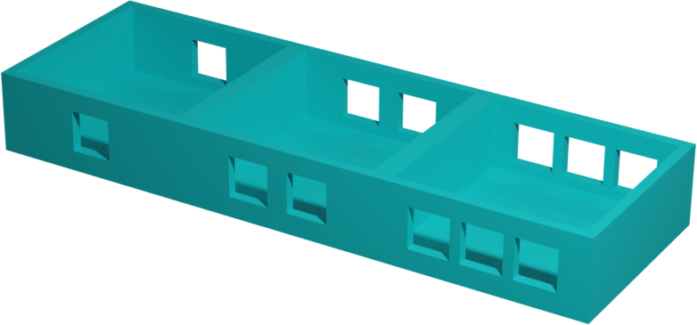
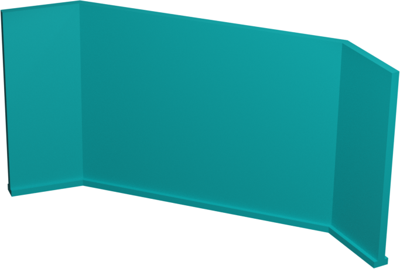

# Rules

Capture your opponent’s flag with your robot to win!

## 1. Setting up

Each player places his robot on his start tile and his flag on base tile. Then uses his barricade to hide his buffer from his opponent.

## 2. Turns

At the start of each turn, each player places his 3 commands on his buffer. There are 6 possible commands:

* Up: Move your robot one tile upwards
* Down: Move your robot one tile downwards
* Left: Move your robot one tile to the left
* Right: Move your robot one tile to the right
* Idle: Your robot don’t perform any action
* Shoot: Your robot performs a shot affecting tiles in a cross pattern, like the tower range on chess. This includes all tiles upwards, downwards, to the left and to the right. If your opponent get caught it will be returned to the start tile.

Notice! You can’t move to a wall, a tile occupied by an idle opponent or your flag and to a tile that your opponent is also moving to. If you happen to do it, your robot will bounce back to his tile of origin and the game will continue normally.

Once both are ready, they reveal their commands at the same time, one by one in the respective order given by buffer.

Notice! Movement commands have priority over shots. This means every time you execute a pair of commands (yours and your opponents) first execute movements (up, down, left, right) and then shots if any.

## 3. Winning the game

First capture your opponent's flag by moving your robot to the same tile as the flag. Once captured, the flag will move along your robot. Win by bringing your opponent flag back to your base tile before your opponent!

## What if...

What if both robots bring the flag back at the same time?

A/ That’s a tie! Play another round from the beginning to untie!

What if you get shot while holding the flag?

A/ Your robot will drop the flag! So your robot gets back to the start tile but the flag stays on the square where the robot was shot.

What if you get shot but still have commands left on the buffer?

A/ Continue executing them normally! But relatively to the new robot position.

What if you get shot and your start tile is occupied by either your opponent or your flag?

A/ In this specific case your opponent wins! You can’t share the same square with your opponent or flag so be careful!

## Glossary

* Robot: Playable character. Outbuffered is a 2 player game and each player controls a robot of his own. 
* Flag: Each player has a flag, your objective is to bring your opponent’s flag to your base tile. 
* Base tile: Tile where your flag is located at the beginning of the match and where you bring your opponent's flag to win.
* Start tile: Special tile where robots are located at the beginning of each match.
* Command: Action that your robot will execute. In order to execute a command, properly place it face up on your buffer. 
* Buffer: Command holder, each turn you choose the commands and place them on your  buffer in the corresponding order from first to last. 
* Barricade: Barrier used to prevent your opponent from peeking at your buffer. 

