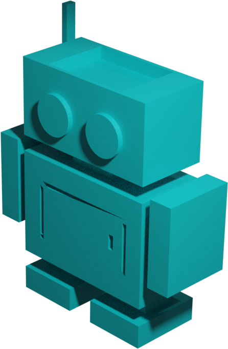
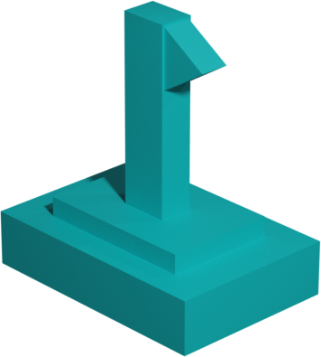
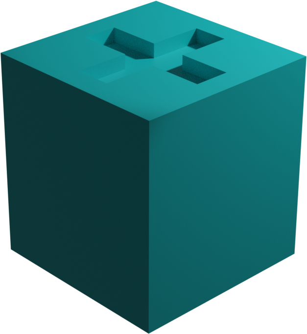
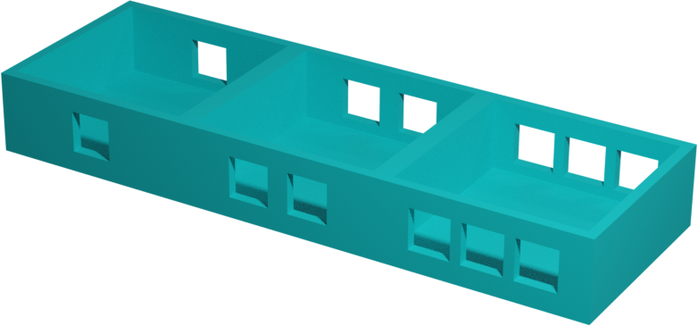
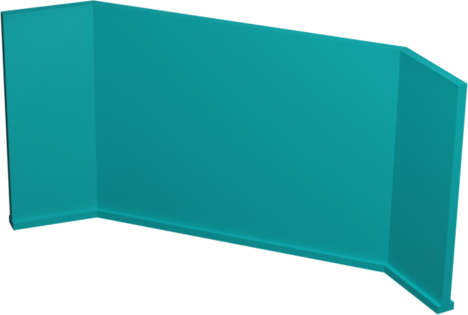

# Reglas

Captura la bandera de tu oponente con la ayuda de tu robot para ganar!

## 1. Iniciando una partida

Cada jugador posiciona su robot en su respectiva casilla de inicio y su bandera en la casilla base. Luego, posiciona su barricada de manera que su oponente no pueda ver su buffer.

## 2. Turnos

Al inicio de cada turno, cada jugador posiciona sus comandos en su buffer. Hay 6 tipos de comandos posibles:

* Arriba: Mueve tu robot una casilla hacia arriba
* Abajo: Mueve tu robot una casilla hacia abajo
* Izquierda: Mueve tu robot una casilla hacia la izquierda
* Derecha: Mueve tu robot una casilla hacia la derecha
* Nada: Tu robot no realiza ninguna acción
* Disparo: Tu robot realiza un disparo afectando las casillas en un patrón estilo cruz, igual que el rango de una torre en ajedrez. Esto incluye todas las casillas a su izquierda, derecha, arriba y abajo. Si su oponente recibe un disparo regresará a su casilla inicial

Atención! No te puedes mover hacia una pared, una casilla ocupada por tu oponente estacionado, tu bandera y hacia una casilla a la que tu oponente también se está moviendo. En caso que esto suceda, tu robot rebotará hacia su casilla de origen y el juego continuará normalmente.

Cuando ambos estén listos, revelarán sus comandos al mismo tiempo. Y serán ejecutados uno por uno en el orden de su respectivo buffer.

Atención! Los comandos de movimiento tienen prioridad sobre los disparos. Esto significa que cada vez que tu ejecutas un par de comandos (el tuyo y el de tu oponente) primero ejecutarán los de movimiento (arriba, abajo, izquierda, derecha) y luego los disparos en caso de haber uno.

## 3. Ganar el juego

Primero captura la bandera de tu oponente posicionando tu robot en la misma casilla de la bandera. Una vez capturada, la bandera se moverá junto a tu robot. Lleva la bandera de tu oponente hacia tu casilla base antes que tu oponente para ganar!

## Qué pasa si...

Qué pasa si ambos robots llevan la bandera a su casilla base al mismo tiempo?

R/ Empate! Juega otra ronda para desempatar!

Qué pasa si recibes un disparo mientras cargas la bandera?

R/ Tu robot soltará la bandera! Esto significa que tu robot regresará a la casilla de inicio y la bandera permanecerá en la casilla donde se recibió el disparo.

Qué pasa si recibes un disparo pero aún tienes comandos pendientes de ejecutar en el buffer?

R/ Continúa ejecutándose normalmente! Pero relativamente a la nueva posición de tu robot.

Qué pasa si recibes un disparo y tu casilla inicial está ocupada por tu oponente o tu bandera?

R/ En este caso específico tu oponente gana! No puedes estar en la misma casilla que tu oponente o tu bandera así que ten cuidado!

## Glosario

* Robot: Personaje jugable. Outbuffered es un juego de 2 jugadores y cada uno controla su robot. 
* Bandera: Cada jugador tiene su bandera, el objetivo del juego es traer la bandera de tu oponente a tu casilla base. 
* Casilla base: Casilla donde tu bandera está posicionada al inicio del juego y donde debes traer la bandera de tu oponente para ganar.
* Casilla de inicio: Casilla especial donde los robots están ubicados al inicio.
* Comando: Acción que tu robot ejecutará. Para ejecutar un comando, posiciónalo boca arriba en tu buffer. 
* Buffer: Porta commandos, cada turno tú eliges los comandos y los posiciones en tu buffer en el orden correspondiente de inicio hasta el final. 
* Barricada: Barrera usada para que tu oponente no pueda ver los comandos mientras los posicionas en tu buffer. 

